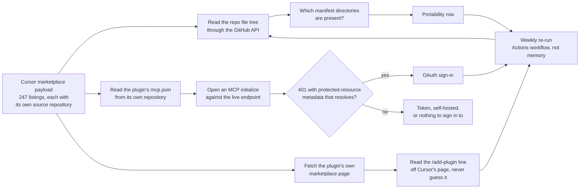

<p align="center">
  <a href="https://awesome.re"></a>
  
  
  
  
  
  
  
</p>

# Awesome Cursor Plugins

**247 plugins from the Cursor marketplace, organized by the job each one does, and for every one
of them: which other agents it also runs in, and whether you have to sign in.**

A [Cursor plugin](https://cursor.com/docs/plugins) is a folder that bundles skills, MCP servers,
rules, agents, commands, and hooks, and drops all of it into the editor at once. Cursor reviews
every listing by hand. The serious vendors ship the same plugin four or five times over, one
manifest per agent, in a single repository. Which agents those are is not on any listing page, so
this list works it out from the source and puts it next to the entry.

---

## Contents

- [⭐ Featured plugin](#-featured-plugin)
- [🚀 Install a Cursor plugin in 30 seconds](#-install-a-cursor-plugin-in-30-seconds)
- [Cursor plugin portability: which agents each plugin also runs in](#cursor-plugin-portability-which-agents-each-plugin-also-runs-in)
- [Cursor MCP plugins and sign-in: OAuth, token, or nothing](#cursor-mcp-plugins-and-sign-in-oauth-token-or-nothing)
- [Cursor plugin marketplace, by what each plugin does](#cursor-plugin-marketplace-by-what-each-plugin-does)
  - [Drive a real browser](#drive-a-real-browser)
  - [Design on a canvas the agent can read](#design-on-a-canvas-the-agent-can-read)
  - [Build the front end](#build-the-front-end)
  - [Keep docs and code context in reach](#keep-docs-and-code-context-in-reach)
  - [Search the web and pull data in](#search-the-web-and-pull-data-in)
  - [Deploy and host](#deploy-and-host)
  - [Databases and search engines](#databases-and-search-engines)
  - [Watch production and debug it](#watch-production-and-debug-it)
  - [Security in the coding loop](#security-in-the-coding-loop)
  - [Issues, pipelines, and code review](#issues-pipelines-and-code-review)
  - [Meetings, docs, and team comms](#meetings-docs-and-team-comms)
  - [Payments, billing, and markets](#payments-billing-and-markets)
  - [Email, SMS, and notifications](#email-sms-and-notifications)
  - [Sales and account research](#sales-and-account-research)
  - [Product analytics and experiments](#product-analytics-and-experiments)
  - [Data platform and machine learning](#data-platform-and-machine-learning)
  - [Reference and market data](#reference-and-market-data)
  - [Travel and spend](#travel-and-spend)
  - [Memory and working habits](#memory-and-working-habits)
  - [Generate media](#generate-media)
  - [Build your own Cursor plugin](#build-your-own-cursor-plugin)
- [Cursor plugin spec, marketplaces, and where to publish](#cursor-plugin-spec-marketplaces-and-where-to-publish)
- [Good to know](#good-to-know)

- **Full catalog:** all 247 Cursor plugins with the complete portability and sign-in matrix in [CATALOG.md](CATALOG.md)
- **Machine-readable:** the same rows as data in [catalog.csv](catalog.csv) and [plugins.json](plugins.json)

---

## ⭐ Featured plugin

**Search YouTube and read the transcript** with
[youtube-mcp](https://github.com/ZeroPointRepo/youtube-mcp) by
[ZeroPointRepo](https://github.com/ZeroPointRepo). Ask for a video, get the words. Search across
channels, pull a full transcript with timestamps, and feed it straight into whatever you are
writing. Hosted MCP server, no Google API key. 8★, MIT.
Also packaged for the Agent Plugins standard · OAuth sign-in.

<details>
<summary>Install</summary>

Paste this in your browser's address bar, or into any link field, to add the server:

```text
cursor://anysphere.cursor-deeplink/mcp/install?name=transcriptapi&config=eyJ1cmwiOiJodHRwczovL3RyYW5zY3JpcHRhcGkuY29tL21jcCJ9
```

Or clone the repo into `~/.cursor/plugins/local/` and reload the window. Free tier at
[transcriptapi.com](https://transcriptapi.com).

</details>

---

## 🚀 Install a Cursor plugin in 30 seconds

**1. Open the agent and type the command.** Every entry in this list carries its own, read off
that plugin's own marketplace page:

```text
/add-plugin playwright
```

**2. Or install from the sidebar.** Open **Customize**, find the plugin, choose **Install**, and
pick a project or user scope. Same flow for both plugin formats.

<!-- nosignin:start -->
**3. Sign in only if the entry says so.** 105 of the 247 have nothing to sign in to. The rest say
`OAuth sign-in`, `Paste a token`, or `Points at your own instance` on their own line, so you know
before you install rather than after.
<!-- nosignin:end -->

> Building one instead of installing one? Start with
> [create-plugin](https://github.com/cursor/plugins/tree/HEAD/create-plugin), which scaffolds the
> folder and validates the manifest against Cursor's published schema before you submit it.

---

## Cursor plugin portability: which agents each plugin also runs in

<!-- portability:start -->
A Cursor plugin is a directory with a manifest in it. Ship a second manifest and the same folder
loads in a second agent. **110 of the 247 listings do exactly that. 137 are Cursor and nothing
else.** Both numbers come from reading the manifest directories in each plugin's own source
repository.

| Also loads in | Plugins | What proves it |
|---|---:|---|
| Claude Code | 106 | `.claude-plugin/plugin.json` |
| Codex | 63 | `.codex-plugin/plugin.json` |
| The Agent Plugins standard | 24 | `plugin.json` at the plugin root |
| GitHub Copilot | 13 | `.github/plugin/plugin.json` |
| Grok Bot | 10 | `.grok-plugin/plugin.json` |
| Kimi | 5 | `.kimi-plugin/plugin.json` |
| Devin | 4 | `.devin-plugin/plugin.json` |
| Antigravity, Cortex, Qoder | 3 | one manifest directory each |

The widest-travelling plugin in the marketplace is
[compound-engineering](https://github.com/EveryInc/compound-engineering-plugin), which ships
manifests for 6 agents besides Cursor.
[atlassian-twg-cli](https://github.com/atlassian-labs/twg-plugins) ships 5.
Per-plugin rows are on every entry below and in [CATALOG.md](CATALOG.md).
<!-- portability:end -->

---

## Cursor MCP plugins and sign-in: OAuth, token, or nothing

<!-- signin:start -->
189 of the 247 plugins bring an MCP server. The question that decides whether you install one
right now is whether it will ask you for credentials, and no listing page answers it. This one
does, from a live handshake against each server.

| What happens when you install | Plugins |
|---|---:|
| OAuth sign-in, click once and you are in | 111 |
| Nothing to sign in to | 105 |
| Paste a token or an API key first | 14 |
| Points at your own instance, so you configure the URL | 12 |
| Could not be established from outside | 5 |

`Nothing to sign in to` covers three honest cases: a plugin that is skills, rules, and commands
only, a local server that runs on your machine, and a remote server that answers an
unauthenticated request. Each entry says which.
<!-- signin:end -->

---

## Cursor plugin marketplace, by what each plugin does

### Drive a real browser

- **Click through your app in a real browser** with [playwright](https://github.com/cursor/plugins/tree/HEAD/third_party/playwright) by [Cursor](https://cursor.com/). 5,031★.
  Cursor only · Runs locally.

  <details>
  <summary>Install</summary>

  ```text
  /add-plugin playwright
  ```

  </details>

- **Let the agent read the console, network tab, and performance trace** with [devtools-for-agents](https://github.com/ChromeDevTools/chrome-devtools-mcp) by [Google Chrome](https://developer.chrome.com/docs/modern-web-guidance). Help your agent build, debug, and verify your code correctly. 49,667★, Apache-2.0.
  Also packaged for Claude Code and GitHub Copilot · Runs locally.

  <details>
  <summary>Install</summary>

  ```text
  /add-plugin devtools-for-agents
  ```

  </details>

- **Point the agent at your own Chrome or a cloud browser** with [browser-use](https://github.com/browser-use/plugins/tree/HEAD/cursor) by [Browser Use](https://browser-use.com). 14★.
  Cursor only · Runs locally.

  <details>
  <summary>Install</summary>

  ```text
  /add-plugin browser-use
  ```

  </details>

- **Navigate, extract, and screenshot pages from one CLI** with [browse](https://github.com/browserbase/browse-plugin) by [Browserbase](https://www.browserbase.com/). 8★.
  Also packaged for Claude Code, Codex, Grok Bot, and the Agent Plugins standard · No sign-in.

  <details>
  <summary>Install</summary>

  ```text
  /add-plugin browse
  ```

  </details>

- **Run the same test across real phones and browsers** with [browserstack](https://github.com/browserstack/browserstack-cursor-plugin) by [Browserstack](https://www.browserstack.com/). BrowserStack integration for Cursor. Test websites and mobile apps on real devices, run automated tests, debug failures. 0★.
  Cursor only · Runs locally.

  <details>
  <summary>Install</summary>

  ```text
  /add-plugin browserstack
  ```

  </details>

- **Catch a visual regression before it ships** with [meticulous](https://github.com/alwaysmeticulous/skills) by [Meticulous](https://meticulous.ai). Agent skills for Meticulous visual regression testing: review test runs, investigate replays, debug diffs. 9★, ISC.
  Also packaged for Claude Code and Devin · OAuth sign-in.

  <details>
  <summary>Install</summary>

  ```text
  /add-plugin meticulous
  ```

  </details>

- **Run and verify a mobile build on cloud devices** with [revyl](https://github.com/RevylAI/revyl-cli/tree/HEAD/cursor-plugin) by [Revyl](https://revyl.ai). 506★.
  Cursor only · No sign-in.

  <details>
  <summary>Install</summary>

  ```text
  /add-plugin revyl
  ```

  </details>


### Design on a canvas the agent can read

- **Turn a Figma frame into code without re-describing it** with [figma](https://github.com/figma/mcp-server-guide) by [Figma](https://www.figma.com). Plugin that includes the Figma MCP server and Skills for common workflows. 1,919★.
  Also packaged for Claude Code and GitHub Copilot · OAuth sign-in.

  <details>
  <summary>Install</summary>

  ```text
  /add-plugin figma
  ```

  </details>

- **Sketch with the agent on a shared whiteboard** with [tldraw](https://github.com/tldraw/tldraw/tree/HEAD/apps/mcp-app/plugins/tldraw-mcp) by [tldraw](https://www.tldraw.dev/). Draw and visually collaborate with your agents inside Cursor. 49,946★.
  Cursor only · No sign-in.

  <details>
  <summary>Install</summary>

  ```text
  /add-plugin tldraw
  ```

  </details>

- **Redesign a screen or a deck on an infinite canvas** with [superdesign](https://github.com/superdesigndev/superdesign-skill) by [Superdesign](http://superdesign.dev/). The design skill for Claude Code, Cursor and any coding agent. Stop shipping AI-slop UI: turn it into shippable. 446★, MIT.
  Also packaged for Claude Code and Codex · No sign-in.

  <details>
  <summary>Install</summary>

  ```text
  /add-plugin superdesign
  ```

  </details>

- **Create and brand-check a Canva design from chat** with [canva](https://github.com/canva-sdks/canva-skills/tree/HEAD/plugins/canva) by [Canva](https://canva.com). 70★, Apache-2.0.
  Also packaged for Claude Code and Codex · OAuth sign-in.

  <details>
  <summary>Install</summary>

  ```text
  /add-plugin canva
  ```

  </details>

- **Design interactive UI on a canvas that reads your repo** with [magicpath](https://github.com/MagicPathAI/magicpath-agent-plugin) by [MagicPath](https://www.magicpath.ai/). Design and build interactive UI on a shared canvas. 0★.
  Also packaged for Claude Code, Codex, and the Agent Plugins standard · OAuth sign-in.

  <details>
  <summary>Install</summary>

  ```text
  /add-plugin magicpath
  ```

  </details>

- **Draw on a canvas your editor can write back to** with [paper-desktop](https://github.com/paper-design/agent-plugins/tree/HEAD/plugins/paper-desktop) by [Paper](https://paper.design/). Design on a canvas that Cursor can read and write to: built on web standards. 17★.
  Also packaged for Claude Code · Runs locally.

  <details>
  <summary>Install</summary>

  ```text
  /add-plugin paper-desktop
  ```

  </details>

- **Pull real product UI references before you design** with [mobbin](https://github.com/mobbin/mobbin-mcp-server) by [Mobbin](https://mobbin.com/). Search real-world UI & UX design references for mobile apps, web apps, and websites with Mobbin. 30★, MIT.
  Also packaged for Grok Bot · OAuth sign-in.

  <details>
  <summary>Install</summary>

  ```text
  /add-plugin mobbin
  ```

  </details>

- **Prototype a UI idea and pull the result into code** with [magic-patterns](https://github.com/magicpatterns/agent-plugins/tree/HEAD/cursor) by [Magic Patterns](https://www.magicpatterns.com/). Use Magic Patterns (magicpatterns.com) from Cursor: prototype ideas, generate UI inspiration, upload local UI. 0★, MIT.
  Cursor only · OAuth sign-in.

  <details>
  <summary>Install</summary>

  ```text
  /add-plugin magic-patterns
  ```

  </details>

- **Read a Miro board as context and push diagrams back** with [miro](https://github.com/miroapp/miro-ai/tree/HEAD/cursor-plugins/miro) by [Miro](https://miro.com/). 149★, MIT.
  Cursor only · OAuth sign-in.

  <details>
  <summary>Install</summary>

  ```text
  /add-plugin miro
  ```

  </details>

- **Search and generate architecture diagrams in Lucid** with [lucid](https://github.com/lucidsoftware/lucid-mcp-server/tree/HEAD/cursor) by [Lucid Software](https://lucid.co/). Ideate, diagram, and align teams by connecting Cursor to Lucid. 1★, Apache-2.0.
  Cursor only · OAuth sign-in.

  <details>
  <summary>Install</summary>

  ```text
  /add-plugin lucid
  ```

  </details>

- **Keep an IcePanel architecture model in sync from the editor** with [icepanel](https://github.com/IcePanel/cursor-plugin) by [IcePanel](https://icepanel.io/). Cursor Plugin for IcePanel - enables AI assistants to manage models, connections, and more across your IcePanel landscape. 0★.
  Cursor only · OAuth sign-in.

  <details>
  <summary>Install</summary>

  ```text
  /add-plugin icepanel
  ```

  </details>


### Build the front end

- **Install components as source you own, not a dependency** with [shadcn](https://github.com/shadcn-ui/ui) by [shadcn](https://github.com/shadcn-ui). UI component and design system framework. 122,038★, MIT.
  Cursor only · Runs locally.

  <details>
  <summary>Install</summary>

  ```text
  /add-plugin shadcn
  ```

  </details>

- **Get timelines and ScrollTrigger right the first time** with [gsap-skills](https://github.com/greensock/gsap-skills) by [GSAP](https://gsap.com/). Official GSAP skills for Cursor, Claude and other AI agents: core animations, timelines, ScrollTrigger, plugins, utilities. 14,288★, MIT.
  Also packaged for Claude Code · No sign-in.

  <details>
  <summary>Install</summary>

  ```text
  /add-plugin gsap-skills
  ```

  </details>

- **Work in Svelte with the framework's own guidance loaded** with [svelte](https://github.com/sveltejs/ai-tools/tree/HEAD/plugins/cursor/svelte) by [Svelte](https://svelte.dev/docs/ai/overview). A plugin for all things related to Svelte development, MCP, skills, and more. 309★, MIT.
  Cursor only · Runs locally.

  <details>
  <summary>Install</summary>

  ```text
  /add-plugin svelte
  ```

  </details>

- **Hold the agent to modern, secure web patterns** with [modern-web-guidance](https://github.com/GoogleChrome/modern-web-guidance) by [Google Chrome](https://developer.chrome.com/docs/modern-web-guidance). 1,831★, Apache-2.0.
  Also packaged for Claude Code, GitHub Copilot, and Grok Bot · No sign-in.

  <details>
  <summary>Install</summary>

  ```text
  /add-plugin modern-web-guidance
  ```

  </details>

- **Build a video in React, programmatically** with [remotion](https://github.com/remotion-dev/cursor-plugin) by [Remotion](https://www.remotion.dev/). Remotion Agent Plugin for Cursor. 0★, MIT.
  Also packaged for the Agent Plugins standard · No sign-in.

  <details>
  <summary>Install</summary>

  ```text
  /add-plugin remotion
  ```

  </details>

- **Publish an HTML app to a live URL in one step** with [here.now](https://github.com/heredotnow/skill) by [here.now](https://here.now). Publish websites, apps, and files to live URLs at {slug}.here.now or custom domains. 41★.
  Also packaged for Codex · No sign-in.

  <details>
  <summary>Install</summary>

  ```text
  /add-plugin here.now
  ```

  </details>


### Keep docs and code context in reach

- **Pull the version of the docs your project actually uses** with [context7-plugin](https://github.com/upstash/context7/tree/HEAD/plugins/claude/context7) by [Upstash](https://upstash.com/). Upstash Context7 MCP server for up-to-date documentation lookup. 61,174★, MIT.
  Also packaged for Claude Code · No sign-in.

  <details>
  <summary>Install</summary>

  ```text
  /add-plugin context7-plugin
  ```

  </details>

- **Give the agent a code context layer across repos** with [githits](https://github.com/githits-com/githits-cli) by [GitHits](https://githits.com/). 84★, Apache-2.0.
  Cursor only · Sign-in not established.

  <details>
  <summary>Install</summary>

  ```text
  /add-plugin githits
  ```

  </details>

- **Search your org's code from inside the editor** with [sourcegraph-cursor-plugin](https://github.com/sourcegraph-community/sourcegraph-cursor-plugin) by [Sourcegraph](https://sourcegraph.com/). Sourcegraph plugin for cursor. 1★.
  Cursor only · Points at your own instance.

  <details>
  <summary>Install</summary>

  ```text
  /add-plugin sourcegraph-cursor-plugin
  ```

  </details>

- **Search your team's remote repositories semantically** with [tabnine](https://github.com/tabnine/skills/tree/HEAD/plugins/cursor/tabnine) by [Tabnine](https://www.tabnine.com/). 8★.
  Cursor only · Points at your own instance.

  <details>
  <summary>Install</summary>

  ```text
  /add-plugin tabnine
  ```

  </details>

- **Search company docs, Slack, and email for the missing detail** with [glean](https://github.com/gleanwork/cursor-plugins/tree/HEAD/glean) by [Glean](https://github.com/gleanwork). 3★, MIT.
  Cursor only · No sign-in.

  <details>
  <summary>Install</summary>

  ```text
  /add-plugin glean
  ```

  </details>

- **Author and publish GitBook docs from chat** with [gitbook](https://github.com/GitbookIO/gitbook-skills) by [GitBook](https://gitbook.com/). Create, configure, and author GitBook documentation sites: site orchestration via the GitBook REST API, Git Sync setup. 7★, MIT.
  Also packaged for Claude Code, Codex, and Grok Bot · OAuth sign-in.

  <details>
  <summary>Install</summary>

  ```text
  /add-plugin gitbook
  ```

  </details>

- **Build a Mintlify docs site with the reference loaded** with [mintlify-cursor-plugin](https://github.com/mintlify/cursor-plugin) by [Mintlify](https://www.mintlify.com/). Comprehensive reference for building Mintlify documentation sites. 1★, MIT.
  Cursor only · OAuth sign-in.

  <details>
  <summary>Install</summary>

  ```text
  /add-plugin mintlify-cursor-plugin
  ```

  </details>


### Search the web and pull data in

- **Run a neural web search and get clean content back** with [exa](https://github.com/exa-labs/exa-cursor-plugin) by [Exa](https://exa.ai). Web search and content extraction powered by Exa AI. 6★, MIT.
  Cursor only · No sign-in.

  <details>
  <summary>Install</summary>

  ```text
  /add-plugin exa
  ```

  </details>

- **Search, crawl, and run deep research from the CLI** with [tavily](https://github.com/tavily-ai/tavily-cursor-plugin) by [Tavily](https://tavily.com). Official Tavily plugin for Cursor. Adds web search, content extraction, website crawling, and AI-powered research capabilities. 2★, MIT.
  Cursor only · OAuth sign-in.

  <details>
  <summary>Install</summary>

  ```text
  /add-plugin tavily
  ```

  </details>

- **Scrape and crawl a site into agent-readable text** with [firecrawl](https://github.com/firecrawl/firecrawl-cursor-plugin) by [Firecrawl](https://firecrawl.dev/). Web scraping, crawling, and search for AI agents. 10★.
  Cursor only · No sign-in.

  <details>
  <summary>Install</summary>

  ```text
  /add-plugin firecrawl
  ```

  </details>

- **Reach pages that block plain scrapers** with [bright-data](https://github.com/brightdata/brightdata-cursor-plugin/tree/HEAD/plugins/bright-data) by [Bright Data](https://www.brightdata.com). Web search, content extraction, structured data, and browser automation powered by Bright Data's web intelligence platform. 5★.
  Cursor only · Paste a token.

  <details>
  <summary>Install</summary>

  ```text
  /add-plugin bright-data
  ```

  </details>

- **Run a scraper from a catalog instead of writing one** with [apify](https://github.com/apify/apify-cursor-plugin/tree/HEAD/apify) by [Apify](https://apify.com/). Official Apify agent skills for web scraping, data extraction, and automation. 2★, Apache-2.0.
  Cursor only · OAuth sign-in.

  <details>
  <summary>Install</summary>

  ```text
  /add-plugin apify
  ```

  </details>

- **Do deep research and enrichment in one pass** with [parallel](https://github.com/parallel-web/parallel-cursor-plugin) by [Parallel](https://parallel.ai/). 3★, MIT.
  Cursor only · No sign-in.

  <details>
  <summary>Install</summary>

  ```text
  /add-plugin parallel
  ```

  </details>

- **Monitor and process the live web on a schedule** with [context-dev](https://github.com/context-dot-dev/cursor-plugin) by [Context.dev](https://www.context.dev/). 2★, MIT.
  Cursor only · OAuth sign-in.

  <details>
  <summary>Install</summary>

  ```text
  /add-plugin context-dev
  ```

  </details>

- **Query 2,600 external API endpoints across 40 providers** with [treg](https://github.com/superdesigndev/treg/tree/HEAD/plugins/treg) by [Superdesign](http://superdesign.dev/). 597★.
  Cursor only · No sign-in.

  <details>
  <summary>Install</summary>

  ```text
  /add-plugin treg
  ```

  </details>

- **Search YouTube and read the transcript** with [youtube-mcp](https://github.com/ZeroPointRepo/youtube-mcp) by [ZeroPointRepo](https://github.com/ZeroPointRepo). Search YouTube and pull a full transcript, no Google API key and nothing to install. 8★, MIT.
  Also packaged for the Agent Plugins standard · OAuth sign-in.

  <details>
  <summary>Install</summary>

  Paste this in your browser's address bar, or into any link field, to add the server:

  ```text
  cursor://anysphere.cursor-deeplink/mcp/install?name=transcriptapi&config=eyJ1cmwiOiJodHRwczovL3RyYW5zY3JpcHRhcGkuY29tL21jcCJ9
  ```

  Or clone the repo into `~/.cursor/plugins/local/` and reload the window. Free tier at
  [transcriptapi.com](https://transcriptapi.com).

  </details>


### Deploy and host

- **Deploy and inspect a Vercel project from chat** with [vercel](https://github.com/vercel/vercel-plugin) by [Vercel](https://vercel.com). Build and deploy web apps and agents. 262★.
  Also packaged for Claude Code and Kimi · OAuth sign-in.

  <details>
  <summary>Install</summary>

  ```text
  /add-plugin vercel
  ```

  </details>

- **Deploy, configure, and troubleshoot a Railway service** with [railway](https://github.com/railwayapp/railway-skills/tree/HEAD/plugins/railway) by [Railway](https://railway.com). Railway agent skills and hosted MCP server for deploying, configuring, monitoring. 312★, MIT.
  Also packaged for Claude Code, Codex, and Grok Bot · OAuth sign-in.

  <details>
  <summary>Install</summary>

  ```text
  /add-plugin railway
  ```

  </details>

- **Deploy, debug, and watch a Render service** with [render](https://github.com/render-oss/render-cursor-plugin/tree/HEAD/plugins/render) by [Render](https://render.com/). 0★.
  Cursor only · OAuth sign-in.

  <details>
  <summary>Install</summary>

  ```text
  /add-plugin render
  ```

  </details>

- **Work with Netlify functions, blobs, and edge config** with [netlify-skills](https://github.com/netlify/context-and-tools) by [Netlify](https://www.netlify.com/). 34★, MIT.
  Also packaged for Claude Code, GitHub Copilot, and Grok Bot · No sign-in.

  <details>
  <summary>Install</summary>

  ```text
  /add-plugin netlify-skills
  ```

  </details>

- **Build on Workers, Durable Objects, and the Agents SDK** with [cloudflare](https://github.com/cloudflare/skills) by [Cloudflare](https://www.cloudflare.com/). Skills for teaching agents how to build on Cloudflare. 2,717★, Apache-2.0.
  Also packaged for Claude Code · OAuth sign-in.

  <details>
  <summary>Install</summary>

  ```text
  /add-plugin cloudflare
  ```

  </details>

- **Prototype and run a Firebase backend** with [firebase](https://github.com/firebase/agent-skills) by [Firebase](https://firebase.com). 421★, Apache-2.0.
  Also packaged for Claude Code, Codex, and Kimi · Runs locally.

  <details>
  <summary>Install</summary>

  ```text
  /add-plugin firebase
  ```

  </details>

- **Write infrastructure as code and operate it on AWS** with [aws-core](https://github.com/aws/agent-toolkit-for-aws/tree/HEAD/plugins/aws-core) by [AWS](https://aws.amazon.com/). 2,422★, Apache-2.0.
  Also packaged for Claude Code, Codex, and the Agent Plugins standard · Runs locally.

  <details>
  <summary>Install</summary>

  ```text
  /add-plugin aws-core
  ```

  </details>

- **Design, deploy, and debug serverless on AWS** with [aws-serverless](https://github.com/awslabs/agent-plugins/tree/HEAD/plugins/aws-serverless) by [AWS](https://aws.amazon.com/). 868★, Apache-2.0.
  Also packaged for Claude Code and Codex · Runs locally.

  <details>
  <summary>Install</summary>

  ```text
  /add-plugin aws-serverless
  ```

  </details>

- **Manage Azure resources and deployments** with [azure](https://github.com/microsoft/azure-skills/tree/HEAD/.github/plugins/azure-skills) by [Azure](https://azure.microsoft.com/). 1,410★, MIT.
  Also packaged for Claude Code · Runs locally.

  <details>
  <summary>Install</summary>

  ```text
  /add-plugin azure
  ```

  </details>

- **Manage Supabase tables, config, and data** with [supabase](https://github.com/supabase-community/cursor-plugin) by [Supabase](https://supabase.com/). Supabase development plugin for Cursor. 8★, MIT.
  Cursor only · OAuth sign-in.

  <details>
  <summary>Install</summary>

  ```text
  /add-plugin supabase
  ```

  </details>

- **Build a reactive TypeScript backend** with [convex](https://github.com/get-convex/convex-agent-plugins) by [Convex](https://www.convex.dev/). An plugin for cursor to empower it to build the best apps ever. 111★, MIT.
  Cursor only · Runs locally.

  <details>
  <summary>Install</summary>

  ```text
  /add-plugin convex
  ```

  </details>

- **Get backend infrastructure generated from your code** with [encore](https://github.com/encoredev/cursor-plugin) by [Encore](https://encore.dev/). Build backends in TypeScript and Go with automatic infrastructure. 1★.
  Cursor only · Runs locally.

  <details>
  <summary>Install</summary>

  ```text
  /add-plugin encore
  ```

  </details>

- **Wire an Appwrite project up correctly** with [appwrite-plugin](https://github.com/appwrite/cursor-plugin) by [Appwrite](https://appwrite.io/). The Appwrite plugin for Cursor includes skills and MCP servers. 9★, BSD-3-Clause.
  Cursor only · OAuth sign-in.

  <details>
  <summary>Install</summary>

  ```text
  /add-plugin appwrite-plugin
  ```

  </details>

- **Deploy a whole application, infrastructure included** with [monk](https://github.com/monk-io/monk-plugin) by [Monk.io](https://monk.io/). Deploy and operate full applications with Monk: cloud infra, SaaS integrations, and containerized workloads: from one chat. 20★, Apache-2.0.
  Also packaged for Claude Code, Codex, GitHub Copilot, and Antigravity · Sign-in not established.

  <details>
  <summary>Install</summary>

  ```text
  /add-plugin monk
  ```

  </details>


### Databases and search engines

- **Explore an Atlas cluster without leaving the editor** with [mongodb-atlas](https://github.com/mongodb/agent-skills/tree/HEAD/plugins/mongodb-atlas) by [MongoDB](https://mongodb.com). Connect to MongoDB Atlas clusters only through the Atlas Managed MCP Server. 175★, Apache-2.0.
  Also packaged for Claude Code, Codex, GitHub Copilot, Grok Bot, and agy · OAuth sign-in.

  <details>
  <summary>Install</summary>

  ```text
  /add-plugin mongodb-atlas
  ```

  </details>

- **Branch a Postgres database like you branch code** with [neon-postgres](https://github.com/neondatabase/agent-skills/tree/HEAD/plugins/neon-postgres) by [Neon](https://neon.com/). Manage your Neon projects, databases, and branches with the Neon agent skills and the Neon MCP Server. 83★, Apache-2.0.
  Also packaged for Claude Code · OAuth sign-in.

  <details>
  <summary>Install</summary>

  ```text
  /add-plugin neon-postgres
  ```

  </details>

- **Inspect PlanetScale branches, schema, and Insights** with [planetscale](https://github.com/planetscale/cursor-plugin) by [PlanetScale](https://planetscale.com). PlanetScale plugin for Cursor. 3★, Apache-2.0.
  Cursor only · OAuth sign-in.

  <details>
  <summary>Install</summary>

  ```text
  /add-plugin planetscale
  ```

  </details>

- **Explore schemas and debug distributed SQL** with [cockroachdb](https://github.com/cockroachdb/cursor-plugin) by [Cockroach Labs](https://www.cockroachlabs.com). CockroachDB development plugin for Cursor. 1★, Apache-2.0.
  Cursor only · OAuth sign-in.

  <details>
  <summary>Install</summary>

  ```text
  /add-plugin cockroachdb
  ```

  </details>

- **Write ClickHouse queries the way ClickHouse wants them** with [clickhouse-cursor-plugin](https://github.com/ClickHouse/clickhouse-cursor-plugin) by [ClickHouse](https://clickhouse.com). ClickHouse Cursor plugin: skills (ClickHouse best practices), rules and MCP. 4★, Apache-2.0.
  Cursor only · OAuth sign-in.

  <details>
  <summary>Install</summary>

  ```text
  /add-plugin clickhouse-cursor-plugin
  ```

  </details>

- **Model CQL data and set up vector search on ScyllaDB** with [scylladb](https://github.com/scylladb/agent-skills) by [ScyllaDB](https://www.scylladb.com/). Official ScyllaDB Agent Skills. 6★, Apache-2.0.
  Also packaged for Claude Code · No sign-in.

  <details>
  <summary>Install</summary>

  ```text
  /add-plugin scylladb
  ```

  </details>

- **Add full-text and vector search to Postgres** with [paradedb](https://github.com/paradedb/cursor-plugin) by [ParadeDB](https://www.paradedb.com/). Official Cursor plugin for ParadeDB. 1★.
  Cursor only · No sign-in.

  <details>
  <summary>Install</summary>

  ```text
  /add-plugin paradedb
  ```

  </details>

- **Create indexes and run semantic search** with [pinecone](https://github.com/pinecone-io/pinecone-cursor-plugin) by [Pinecone](https://pinecone.io/). Pinecone vector database integration for Cursor. 1★, MIT.
  Cursor only · Runs locally.

  <details>
  <summary>Install</summary>

  ```text
  /add-plugin pinecone
  ```

  </details>

- **Query a vector and full-text store from chat** with [turbopuffer](https://github.com/turbopuffer/skills/tree/HEAD/plugins/turbopuffer) by [turbopuffer](https://turbopuffer.com). 7★.
  Also packaged for Claude Code · Paste a token.

  <details>
  <summary>Install</summary>

  ```text
  /add-plugin turbopuffer
  ```

  </details>

- **Automate the schema and migration side of Prisma** with [prisma](https://github.com/prisma/cursor-plugin) by [Prisma](https://www.prisma.io/). The official Prisma plugin for Cursor: MCP server integration, rules, skills, and automation for database development. 8★.
  Cursor only · Paste a token.

  <details>
  <summary>Install</summary>

  ```text
  /add-plugin prisma
  ```

  </details>

- **Get Redis data structures and caching right** with [redis-development](https://github.com/redis/agent-skills) by [Redis](https://redis.com). 124★, MIT.
  Cursor only · No sign-in.

  <details>
  <summary>Install</summary>

  ```text
  /add-plugin redis-development
  ```

  </details>

- **Work with Elasticsearch, Kibana, and ES|QL** with [elastic](https://github.com/elastic/cursor-plugins/tree/HEAD/elastic) by [Elastic](https://elastic.co). 31★, Apache-2.0.
  Cursor only · No sign-in.

  <details>
  <summary>Install</summary>

  ```text
  /add-plugin elastic
  ```

  </details>

- **Stand up OpenSearch for semantic or hybrid search** with [opensearch-agent-skills](https://github.com/opensearch-project/opensearch-agent-skills) by [OpenSearch](https://opensearch.org). 49★, Apache-2.0.
  Also packaged for Claude Code · OAuth sign-in.

  <details>
  <summary>Install</summary>

  ```text
  /add-plugin opensearch-agent-skills
  ```

  </details>


### Watch production and debug it

- **Take a Sentry issue straight into a fix** with [sentry](https://github.com/getsentry/plugin-cursor) by [Sentry](https://sentry.io/). Sentry Plugin for Cursor to help with debugging including MCP and skill capabilities. 1★, MIT.
  Cursor only · OAuth sign-in.

  <details>
  <summary>Install</summary>

  ```text
  /add-plugin sentry
  ```

  </details>

- **Read analytics, flags, and error tracking in context** with [posthog](https://github.com/PostHog/ai-plugin) by [PostHog](https://posthog.com/). Official PostHog plugin for Claude Code, Cursor, Gemini, Codex and other AI coding tools. 77★.
  Also packaged for Claude Code and Codex · OAuth sign-in.

  <details>
  <summary>Install</summary>

  ```text
  /add-plugin posthog
  ```

  </details>

- **Query Grafana Cloud without a local install** with [grafana-cloud-mcp](https://github.com/grafana/ai-marketplace/tree/HEAD/plugins/grafana-cloud-mcp) by [Grafana Labs](https://grafana.com/). 17★, Apache-2.0.
  Also packaged for Claude Code and Codex · OAuth sign-in.

  <details>
  <summary>Install</summary>

  ```text
  /add-plugin grafana-cloud-mcp
  ```

  </details>

- **Ask your logs, metrics, traces, and dashboards a question** with [datadog](https://github.com/datadog-labs/cursor-plugin) by [Datadog](https://www.datadoghq.com/). Use Datadog directly in Cursor through a preconfigured Datadog MCP server. 10★, Apache-2.0.
  Cursor only · Points at your own instance.

  <details>
  <summary>Install</summary>

  ```text
  /add-plugin datadog
  ```

  </details>

- **Write DQL and investigate a problem end to end** with [dynatrace](https://github.com/Dynatrace/dynatrace-for-ai) by [Dynatrace](https://www.dynatrace.com/). Skills, prompts, and instructions for building AI agents on top of Dynatrace production context. 126★, Apache-2.0.
  Also packaged for Claude Code · Points at your own instance.

  <details>
  <summary>Install</summary>

  ```text
  /add-plugin dynatrace
  ```

  </details>

- **Handle incidents, schedules, and on-call from the editor** with [pagerduty](https://github.com/PagerDuty/cursor-plugin) by [PagerDuty](https://www.pagerduty.com/). Cursor Plugin that scores the risk of committing code using PagerDuty MCP. 0★, Apache-2.0.
  Cursor only · OAuth sign-in.

  <details>
  <summary>Install</summary>

  ```text
  /add-plugin pagerduty
  ```

  </details>

- **Run an investigation with production context attached** with [resolve-ai](https://github.com/resolve-ai-oss/resolve-ai-plugins/tree/HEAD/plugins/cursor/resolve-ai) by [Resolve AI](https://resolve.ai). Use Resolve for investigations, incidents, and production context. 4★, Apache-2.0.
  Cursor only · OAuth sign-in.

  <details>
  <summary>Install</summary>

  ```text
  /add-plugin resolve-ai
  ```

  </details>

- **Triage a problem down to its root cause** with [antimetal](https://github.com/antimetal/cursor-plugin) by [Antimetal](https://antimetal.com). Bring Antimetal's software investigation intelligence into your editor. 1★, MIT.
  Also packaged for Claude Code · OAuth sign-in.

  <details>
  <summary>Install</summary>

  ```text
  /add-plugin antimetal
  ```

  </details>

- **Investigate an issue against your existing observability** with [tierzero](https://github.com/TierZeroAI/tierzero-cursor/tree/HEAD/plugins/tierzero) by [TierZero](https://www.tierzero.ai/). Agentic production engineering for SWE, SRE and DevOps. 0★, MIT.
  Cursor only · OAuth sign-in.

  <details>
  <summary>Install</summary>

  ```text
  /add-plugin tierzero
  ```

  </details>

- **Look at the network path when the app is not the problem** with [thousandeyes](https://github.com/thousandeyes/thousandeyes-ai-agents-toolkit) by [Cisco ThousandEyes](https://cisco.com). Connect Cursor to ThousandEyes MCP endpoints for network intelligence workflows. 3★, Apache-2.0.
  Also packaged for Claude Code · OAuth sign-in.

  <details>
  <summary>Install</summary>

  ```text
  /add-plugin thousandeyes
  ```

  </details>

- **Ask your internal developer portal who owns what** with [port](https://github.com/port-labs/cursor-plugin) by [Port](https://www.port.io/). Port MCP Server Gives Cursor's AI agent full engineering context. 0★, MIT.
  Cursor only · OAuth sign-in.

  <details>
  <summary>Install</summary>

  ```text
  /add-plugin port
  ```

  </details>


### Security in the coding loop

- **Enforce 7,000 quality and security rules as the agent writes** with [sonarqube](https://github.com/SonarSource/sonarqube-agent-plugins) by [SonarSource](https://www.sonarsource.com/). SonarQube Plugin for AI Agents. 100★.
  Also packaged for Claude Code, Codex, GitHub Copilot, and the Agent Plugins standard · Runs locally.

  <details>
  <summary>Install</summary>

  ```text
  /add-plugin sonarqube
  ```

  </details>

- **Scan and remediate dependency and code issues** with [snyk-secure-development](https://github.com/snyk/studio-recipes/tree/HEAD/plugins/cursor) by [Snyk](https://snyk.io). Snyk security scanning, remediation, and dependency health for Cursor. 61★, Apache-2.0.
  Cursor only · Runs locally.

  <details>
  <summary>Install</summary>

  ```text
  /add-plugin snyk-secure-development
  ```

  </details>

- **Run Semgrep rules through MCP and hooks** with [semgrep-plugin](https://github.com/semgrep/cursor-plugin) by [Semgrep](https://semgrep.dev/). Home for the Semgrep Cursor Plugin. 1★.
  Cursor only · Runs locally.

  <details>
  <summary>Install</summary>

  ```text
  /add-plugin semgrep-plugin
  ```

  </details>

- **Swap in hardened images and check advisories** with [chainguard](https://github.com/chainguard-dev/chainguard-cursor-plugin) by [Chainguard](https://www.chainguard.dev/). 0★.
  Cursor only · OAuth sign-in.

  <details>
  <summary>Install</summary>

  ```text
  /add-plugin chainguard
  ```

  </details>

- **Put a security workflow agent in front of your dependencies** with [endorlabs](https://github.com/endorlabs/ai-plugins/tree/HEAD/plugins/cursor/endor-labs-agent-kit) by [Endor Labs](https://www.endorlabs.com). Endor Labs Agent Kit setup and security workflow agents and skills for Cursor. 9★, MIT.
  Cursor only · Runs locally.

  <details>
  <summary>Install</summary>

  ```text
  /add-plugin endorlabs
  ```

  </details>

- **Check a dependency before you add it** with [sonatype-cursor-plugin](https://github.com/sonatype/sonatype-cursor-plugin) by [Sonatype](https://www.sonatype.com/). AI-powered dependency intelligence. Check vulnerabilities, find safer versions. 0★, MIT.
  Cursor only · No sign-in.

  <details>
  <summary>Install</summary>

  ```text
  /add-plugin sonatype-cursor-plugin
  ```

  </details>

- **Build on the Falcon platform with the docs loaded** with [crowdstrike-falcon-foundry](https://github.com/CrowdStrike/foundry-skills) by [CrowdStrike](https://crowdstrike.com). CrowdStrike Falcon Foundry development skills for building cybersecurity applications on the Falcon platform. 24★, MIT.
  Also packaged for Claude Code, Codex, and the Agent Plugins standard · No sign-in.

  <details>
  <summary>Install</summary>

  ```text
  /add-plugin crowdstrike-falcon-foundry
  ```

  </details>

- **Manage ZPA, ZIA, and ZDX policy from chat** with [zscaler](https://github.com/zscaler/zscaler-mcp-server) by [Zscaler](https://www.zscaler.com/). Zscaler Integration MCP Server is a Model Context Protocol (MCP) server designed for managing Several Zscaler Products using Large Language. 46★, MIT.
  Also packaged for Claude Code · Paste a token.

  <details>
  <summary>Install</summary>

  ```text
  /add-plugin zscaler
  ```

  </details>

- **Create and load project secrets without pasting them** with [1password](https://github.com/1Password/cursor-plugin) by [1Password](https://1password.com). 8★, MIT.
  Cursor only · Runs locally.

  <details>
  <summary>Install</summary>

  ```text
  /add-plugin 1password
  ```

  </details>

- **See what MCP servers and skills are actually running** with [runlayer](https://github.com/runlayer/plugins/tree/HEAD/cursor-plugin) by [Runlayer](https://www.runlayer.com/). Simpler, safer way to run MCPs, Skills, and Agents. 6★.
  Cursor only · No sign-in.

  <details>
  <summary>Install</summary>

  ```text
  /add-plugin runlayer
  ```

  </details>


### Issues, pipelines, and code review

- **Work repos, issues, pull requests, and Actions** with [github](https://github.com/cursor/plugins/tree/HEAD/third_party/github) by [Cursor](https://cursor.com/). 5,031★.
  Cursor only · OAuth sign-in.

  <details>
  <summary>Install</summary>

  ```text
  /add-plugin github
  ```

  </details>

- **Plan and track issues, MRs, and pipelines** with [gitlab](https://github.com/nickveenhof/cursor-gitlab-plugin) by [GitLab](https://about.gitlab.com/). Connect Cursor to GitLab with the GitLab MCP server. 2★, MIT.
  Cursor only · OAuth sign-in.

  <details>
  <summary>Install</summary>

  ```text
  /add-plugin gitlab
  ```

  </details>

- **Move Linear issues and projects without switching tabs** with [linear](https://github.com/linear/cursor-plugin) by [Linear](https://linear.app/). 8★.
  Cursor only · OAuth sign-in.

  <details>
  <summary>Install</summary>

  ```text
  /add-plugin linear
  ```

  </details>

- **Work Jira and Confluence, including triage and status reports** with [atlassian](https://github.com/atlassian/atlassian-mcp-server) by [Atlassian](https://atlassian.com). 983★, Apache-2.0.
  Also packaged for Claude Code and the Agent Plugins standard · OAuth sign-in.

  <details>
  <summary>Install</summary>

  ```text
  /add-plugin atlassian
  ```

  </details>

- **Manage ClickUp tasks and time tracking** with [clickup](https://github.com/clickup/clickup-plugin) by [ClickUp](https://clickup.com). Official ClickUp plugin: connect your workspace to your favorite AI coding tools. 1★, MIT.
  Also packaged for Claude Code and the Agent Plugins standard · OAuth sign-in.

  <details>
  <summary>Install</summary>

  ```text
  /add-plugin clickup
  ```

  </details>

- **Create and update Asana work from the editor** with [asana](https://github.com/Asana/cursor-marketplace-plugin) by [Asana](https://asana.com/). 0★, MIT.
  Cursor only · OAuth sign-in.

  <details>
  <summary>Install</summary>

  ```text
  /add-plugin asana
  ```

  </details>

- **Get a morning briefing and forecast out of monday CRM** with [monday-crm](https://github.com/mondaycom/mcp/tree/HEAD/plugins/monday-crm) by [Monday.com](https://monday.com). 420★, MIT.
  Also packaged for Claude Code · OAuth sign-in.

  <details>
  <summary>Install</summary>

  ```text
  /add-plugin monday-crm
  ```

  </details>

- **Design pipelines and troubleshoot builds** with [buildkite](https://github.com/buildkite/skills) by [Buildkite](https://buildkite.com/home/). Official Buildkite skills for Claude Code, Cursor, and other AI coding agents. 15★, MIT.
  Also packaged for Claude Code · OAuth sign-in.

  <details>
  <summary>Install</summary>

  ```text
  /add-plugin buildkite
  ```

  </details>

- **Build, deploy, and govern through Harness** with [harness](https://github.com/harness/harness-ai/tree/HEAD/plugins/cursor) by [Harness](https://www.harness.io/). Harness Skills + Harness MCP server packaged as a Cursor plugin. 18★, Apache-2.0.
  Cursor only · OAuth sign-in.

  <details>
  <summary>Install</summary>

  ```text
  /add-plugin harness
  ```

  </details>

- **Run a review pass and guard the autofix** with [coderabbit](https://github.com/coderabbitai/cursor-plugin) by [CodeRabbit](https://coderabbit.ai/). Run CodeRabbit reviews for code, PR, security, and quality checks, plus guarded autofix for unresolved GitHub PR feedback in Cursor. 2★, MIT.
  Cursor only · No sign-in.

  <details>
  <summary>Install</summary>

  ```text
  /add-plugin coderabbit
  ```

  </details>

- **Get a deep correctness and security audit of a branch** with [thermos](https://github.com/cursor/plugins/tree/HEAD/thermos) by [Cursor](https://cursor.com/). 5,031★.
  Cursor only · No sign-in.

  <details>
  <summary>Install</summary>

  ```text
  /add-plugin thermos
  ```

  </details>

- **Read a big diff as a canvas grouped by importance** with [pr-review-canvas](https://github.com/cursor/plugins/tree/HEAD/pr-review-canvas) by [Cursor](https://cursor.com/). Render PR diffs as review canvases grouped by importance. 5,031★.
  Cursor only · No sign-in.

  <details>
  <summary>Install</summary>

  ```text
  /add-plugin pr-review-canvas
  ```

  </details>


### Meetings, docs, and team comms

- **Search channels and post from the editor** with [slack](https://github.com/slackapi/slack-mcp-plugin) by [Slack](https://slack.com/). Slack MCP server. Search channels, send messages, and perform other Slack actions through MCP-compatible clients. 106★, MIT.
  Also packaged for Claude Code and Codex · OAuth sign-in.

  <details>
  <summary>Install</summary>

  ```text
  /add-plugin slack
  ```

  </details>

- **Read and write Notion pages as working context** with [notion-workspace](https://github.com/makenotion/cursor-notion-plugin) by [Notion](https://www.notion.so/). Notion Skills + Notion MCP server packaged as a Cursor plugin. 24★.
  Cursor only · OAuth sign-in.

  <details>
  <summary>Install</summary>

  ```text
  /add-plugin notion-workspace
  ```

  </details>

- **Recall what the team actually decided in the meeting** with [granola](https://github.com/granola-inc/granola-cursor-plugin) by [Granola](https://granola.ai). Your meetings in your workflow. Granola gives Cursor access to what your team discussed, decided, and committed to. 1★.
  Cursor only · OAuth sign-in.

  <details>
  <summary>Install</summary>

  ```text
  /add-plugin granola
  ```

  </details>

- **Search meetings, transcripts, and action items** with [circleback](https://github.com/cursor/plugins/tree/HEAD/third_party/circleback) by [Cursor](https://cursor.com/). 5,031★.
  Cursor only · OAuth sign-in.

  <details>
  <summary>Install</summary>

  ```text
  /add-plugin circleback
  ```

  </details>

- **Pull a Zoom transcript into the task you are on** with [zoom](https://github.com/cursor/plugins/tree/HEAD/third_party/zoom) by [Cursor](https://cursor.com/). Search meetings, pull transcripts, and work with Zoom Docs. 5,031★.
  Cursor only · OAuth sign-in.

  <details>
  <summary>Install</summary>

  ```text
  /add-plugin zoom
  ```

  </details>

- **Write the PRD from code context and implement from it** with [chatprd](https://github.com/ChatPRD/cursor-plugin) by [ChatPRD](https://www.chatprd.ai/). 5★, MIT.
  Cursor only · OAuth sign-in.

  <details>
  <summary>Install</summary>

  ```text
  /add-plugin chatprd
  ```

  </details>

- **Handle support threads and customers** with [plain](https://github.com/team-plain/cursor-plugin-mcp) by [Plain](https://plain.com). 1★, MIT.
  Cursor only · OAuth sign-in.

  <details>
  <summary>Install</summary>

  ```text
  /add-plugin plain
  ```

  </details>

- **Read, search, and update Falconer documents** with [falconer](https://github.com/FalconerAI/agent-integrations/tree/HEAD/plugins/falconer) by [Falconer](https://falconer.com). 0★, Apache-2.0.
  Also packaged for Claude Code and Codex · OAuth sign-in.

  <details>
  <summary>Install</summary>

  ```text
  /add-plugin falconer
  ```

  </details>

- **Record a short video update of the agent's work** with [mainframe](https://github.com/mainframecomputer/mainframe-plugins) by [Mainframe](https://mainframe.app/). 12★.
  Also packaged for Claude Code and Codex · OAuth sign-in.

  <details>
  <summary>Install</summary>

  ```text
  /add-plugin mainframe
  ```

  </details>


### Payments, billing, and markets

- **Get the Stripe integration and the API upgrade right** with [stripe](https://github.com/stripe/ai/tree/HEAD/providers/cursor/plugin) by [Stripe](https://stripe.com/). 1,763★, MIT.
  Cursor only · OAuth sign-in.

  <details>
  <summary>Install</summary>

  ```text
  /add-plugin stripe
  ```

  </details>

- **Let an agent pay with a one-time credential** with [link](https://github.com/stripe/link-cli/tree/HEAD/plugins/link) by [Stripe Link](https://stripe.com/payments/link). Get secure, one-time-use payment credentials from a Link wallet so agents can complete purchases on your behalf. 705★, MIT.
  Also packaged for Claude Code and Codex · Sign-in not established.

  <details>
  <summary>Install</summary>

  ```text
  /add-plugin link
  ```

  </details>

- **Configure subscriptions and read project data** with [revenuecat](https://github.com/RevenueCat/ai-toolkit/tree/HEAD/revenuecat) by [RevenueCat](https://www.revenuecat.com/). 62★, MIT.
  Also packaged for Claude Code, Codex, and the Agent Plugins standard · OAuth sign-in.

  <details>
  <summary>Install</summary>

  ```text
  /add-plugin revenuecat
  ```

  </details>

- **Follow Chargebee's own billing and webhook patterns** with [chargebee-integration](https://github.com/chargebee/ai) by [Chargebee](https://www.chargebee.com/). skills.md and agent.md for Chargebee. 6★.
  Cursor only · No sign-in.

  <details>
  <summary>Install</summary>

  ```text
  /add-plugin chargebee-integration
  ```

  </details>

- **Orchestrate global money movement in plain language** with [airwallex-agentos](https://github.com/airwallex/airwallex-marketplace/tree/HEAD/plugins/airwallex-agentos) by [Airwallex](https://www.airwallex.com/us). Bring Airwallex's global financial infrastructure to Cursor. 5★, Apache-2.0.
  Also packaged for Claude Code and Codex · OAuth sign-in.

  <details>
  <summary>Install</summary>

  ```text
  /add-plugin airwallex-agentos
  ```

  </details>

- **Ship USDC payments and cross-chain transfers** with [circle](https://github.com/circlefin/skills/tree/HEAD/plugins/circle) by [Circle](https://www.circle.com/). 144★, Apache-2.0.
  Also packaged for Claude Code and Codex · No sign-in.

  <details>
  <summary>Install</summary>

  ```text
  /add-plugin circle
  ```

  </details>

- **Launch a storefront, take payments, and run ads** with [whop](https://github.com/whopio/whop-mcp-server) by [Whop](https://whop.com). Build and run your business end-to-end with Whop. 2★, Apache-2.0.
  Cursor only · OAuth sign-in.

  <details>
  <summary>Install</summary>

  ```text
  /add-plugin whop
  ```

  </details>

- **Query cloud costs, budgets, and recommendations** with [vantage](https://github.com/vantage-sh/cursor-plugin) by [Vantage](https://vantage.sh). Vantage's plugin for Cursor. 1★.
  Cursor only · Paste a token.

  <details>
  <summary>Install</summary>

  ```text
  /add-plugin vantage
  ```

  </details>

- **Run spend analysis, approvals, and vendor workflows** with [ramp](https://github.com/ramp-public/cursor-plugin) by [Ramp](https://ramp.com). 1★, MIT.
  Cursor only · OAuth sign-in.

  <details>
  <summary>Install</summary>

  ```text
  /add-plugin ramp
  ```

  </details>

- **Trade crypto, stocks, and forex, on paper by default** with [kraken-cli](https://github.com/krakenfx/kraken-cli) by [Kraken](https://www.kraken.com/). 694★, MIT.
  Also packaged for Claude Code and Codex · Runs locally.

  <details>
  <summary>Install</summary>

  ```text
  /add-plugin kraken-cli
  ```

  </details>

- **Give the agent a wallet across supported chains** with [phantom-connect](https://github.com/phantom/phantom-agent-kit) by [Phantom](https://phantom.com). 9★, MIT.
  Also packaged for Claude Code · No sign-in.

  <details>
  <summary>Install</summary>

  ```text
  /add-plugin phantom-connect
  ```

  </details>

- **Quote and execute intent-based and cross-chain swaps** with [1inch-mcp](https://github.com/1inch/1inch-ai) by [1inch](https://business.1inch.com/). 1inch AI integrations: Agent Skills, MCP server configs, and marketplace distribution for Claude, Cursor, and other AI assistants. 2★, MIT.
  Also packaged for Claude Code · No sign-in.

  <details>
  <summary>Install</summary>

  ```text
  /add-plugin 1inch-mcp
  ```

  </details>


### Email, SMS, and notifications

- **Send, template, and troubleshoot email deliverability** with [resend](https://github.com/resend/resend-skills) by [Resend](https://resend.com/). Agent Skills for working with Resend to send and receive emails. 167★, MIT.
  Also packaged for Claude Code, Grok Bot, and the Agent Plugins standard · OAuth sign-in.

  <details>
  <summary>Install</summary>

  ```text
  /add-plugin resend
  ```

  </details>

- **Get the Twilio API order right the first time** with [twilio-developer-kit](https://github.com/twilio/ai) by [Twilio](https://www.twilio.com/). Twilio Skills and MCP provide procedural knowledge for AI coding agents: which APIs to use, in what order, and what to avoid. 30★, MIT.
  Also packaged for Claude Code and Codex · No sign-in.

  <details>
  <summary>Install</summary>

  ```text
  /add-plugin twilio-developer-kit
  ```

  </details>

- **Ship SMS, WhatsApp, RCS, voice, and verification** with [sinch-cursor-plugin](https://github.com/sinch/sinch-plugins/tree/HEAD/plugins/sinch-cursor-plugin) by [Sinch](https://sinch.com/). 6★, Apache-2.0.
  Cursor only · Paste a token.

  <details>
  <summary>Install</summary>

  ```text
  /add-plugin sinch-cursor-plugin
  ```

  </details>

- **Triage deliverability, DNS, and suppressions** with [mailgun-cursor](https://github.com/mailgun/mailgun-plugins/tree/HEAD/plugins/mailgun-cursor) by [Sinch](https://sinch.com/). 0★, Apache-2.0.
  Cursor only · Paste a token.

  <details>
  <summary>Install</summary>

  ```text
  /add-plugin mailgun-cursor
  ```

  </details>

- **Give the agent its own inbox** with [agentmail](https://github.com/agentmail-to/agentmail-plugins) by [AgentMail](https://www.agentmail.to/). AI-native email infrastructure for coding agents. 8★, MIT.
  Also packaged for Claude Code and Codex · OAuth sign-in.

  <details>
  <summary>Install</summary>

  ```text
  /add-plugin agentmail
  ```

  </details>

- **Work a Superhuman inbox from chat** with [mcp-mail](https://github.com/superhuman/mcp-mail) by [Superhuman Mail](https://superhuman.com/products/mail). Superhuman Mail MCP Server. 27★, MIT.
  Also packaged for Codex · OAuth sign-in.

  <details>
  <summary>Install</summary>

  ```text
  /add-plugin mcp-mail
  ```

  </details>

- **Send and manage push notifications** with [onesignal](https://github.com/OneSignal/onesignal-cursor-plugin) by [OneSignal](https://onesignal.com). Connect Cursor to OneSignal through the OneSignal MCP server. 0★, MIT.
  Cursor only · OAuth sign-in.

  <details>
  <summary>Install</summary>

  ```text
  /add-plugin onesignal
  ```

  </details>


### Sales and account research

- **Enrich people and companies and run research agents** with [clay](https://github.com/cursor/plugins/tree/HEAD/third_party/clay) by [Cursor](https://cursor.com/). 5,031★.
  Cursor only · OAuth sign-in.

  <details>
  <summary>Install</summary>

  ```text
  /add-plugin clay
  ```

  </details>

- **Prospect, enrich, and load an outreach sequence** with [apollo](https://github.com/apolloio/apollo-mcp-plugin) by [Apollo.io](https://apollo.io). Connect Claude Code + Cowork to Apollo MCP via this plugin. 18★, MIT.
  Also packaged for Claude Code · OAuth sign-in.

  <details>
  <summary>Install</summary>

  ```text
  /add-plugin apollo
  ```

  </details>

- **Query a verified graph of 100M companies** with [zoominfo](https://github.com/Zoominfo/zoominfo-mcp-plugin) by [ZoomInfo](https://www.zoominfo.com/). 6★, MIT.
  Also packaged for Claude Code and Codex · OAuth sign-in.

  <details>
  <summary>Install</summary>

  ```text
  /add-plugin zoominfo
  ```

  </details>

- **Search and update contacts, deals, and tickets** with [hubspot](https://github.com/cursor/plugins/tree/HEAD/third_party/hubspot) by [Cursor](https://cursor.com/). 5,031★.
  Cursor only · OAuth sign-in.

  <details>
  <summary>Install</summary>

  ```text
  /add-plugin hubspot
  ```

  </details>

- **Pull deal insights and call briefs** with [gong](https://github.com/cursor/plugins/tree/HEAD/third_party/gong) by [Cursor](https://cursor.com/). 5,031★.
  Cursor only · OAuth sign-in.

  <details>
  <summary>Install</summary>

  ```text
  /add-plugin gong
  ```

  </details>

- **Search sequences, prospects, and meetings** with [outreach](https://github.com/cursor/plugins/tree/HEAD/third_party/outreach) by [Cursor](https://cursor.com/). 5,031★.
  Cursor only · OAuth sign-in.

  <details>
  <summary>Install</summary>

  ```text
  /add-plugin outreach
  ```

  </details>

- **Enrich leads and run sequences** with [amplemarket](https://github.com/cursor/plugins/tree/HEAD/third_party/amplemarket) by [Cursor](https://cursor.com/). 5,031★.
  Cursor only · OAuth sign-in.

  <details>
  <summary>Install</summary>

  ```text
  /add-plugin amplemarket
  ```

  </details>

- **Search candidates and manage the hiring pipeline** with [ashby](https://github.com/cursor/plugins/tree/HEAD/third_party/ashby) by [Cursor](https://cursor.com/). 5,031★.
  Cursor only · OAuth sign-in.

  <details>
  <summary>Install</summary>

  ```text
  /add-plugin ashby
  ```

  </details>

- **Query recruiting analytics and sourcing agents** with [juicebox](https://github.com/cursor/plugins/tree/HEAD/third_party/juicebox) by [Cursor](https://cursor.com/). 5,031★.
  Cursor only · OAuth sign-in.

  <details>
  <summary>Install</summary>

  ```text
  /add-plugin juicebox
  ```

  </details>

- **Track how AI answers talk about your brand** with [profound](https://github.com/cursor/plugins/tree/HEAD/third_party/profound) by [Cursor](https://cursor.com/). Track AI visibility, sentiment, and citations. 5,031★.
  Cursor only · OAuth sign-in.

  <details>
  <summary>Install</summary>

  ```text
  /add-plugin profound
  ```

  </details>

- **Connect the editor to your governed data catalog** with [atlan](https://github.com/atlanhq/agent-toolkit/tree/HEAD/cursor-plugin) by [Atlan](https://atlan.com/). Atlan is the context layer for enterprise AI. 32★, MIT.
  Cursor only · OAuth sign-in.

  <details>
  <summary>Install</summary>

  ```text
  /add-plugin atlan
  ```

  </details>


### Product analytics and experiments

- **Instrument analytics and analyze the charts** with [amplitude](https://github.com/amplitude/mcp-marketplace/tree/HEAD/plugins/amplitude) by [Amplitude](https://amplitude.com/). 34★, MIT.
  Also packaged for Claude Code and Codex · OAuth sign-in.

  <details>
  <summary>Install</summary>

  ```text
  /add-plugin amplitude
  ```

  </details>

- **Implement tracking and investigate a metric** with [mixpanel-mcp](https://github.com/mixpanel/ai-plugins) by [Mixpanel](https://mixpanel.com/home/). 14★, Apache-2.0.
  Cursor only · Sign-in not established.

  <details>
  <summary>Install</summary>

  ```text
  /add-plugin mixpanel-mcp
  ```

  </details>

- **Manage feature flags and AI configs** with [launchdarkly](https://github.com/launchdarkly/agent-skills) by [LaunchDarkly](https://launchdarkly.com). LaunchDarkly agent skills and mcp server for feature flag management, AI configuration, and skill authoring. 25★.
  Also packaged for Claude Code and Codex · OAuth sign-in.

  <details>
  <summary>Install</summary>

  ```text
  /add-plugin launchdarkly
  ```

  </details>

- **Run experiments and flags from Spotify's platform** with [confidence](https://github.com/spotify/confidence-ai-plugins) by [Confidence by Spotify](https://confidence.spotify.com/). 8★, Apache-2.0.
  Also packaged for Claude Code and Codex · OAuth sign-in.

  <details>
  <summary>Install</summary>

  ```text
  /add-plugin confidence
  ```

  </details>

- **Ask governed company data a question** with [basedash](https://github.com/Basedash/cursor-plugin) by [Basedash](https://www.basedash.com). 0★, MIT.
  Also packaged for Claude Code · OAuth sign-in.

  <details>
  <summary>Install</summary>

  ```text
  /add-plugin basedash
  ```

  </details>

- **Connect a Hex workspace for analytics work** with [hex](https://github.com/hex-inc/hex-cursor-plugin) by [Hex](https://hex.tech/). Hex repo for Cursor Plugin Market. 1★.
  Cursor only · OAuth sign-in.

  <details>
  <summary>Install</summary>

  ```text
  /add-plugin hex
  ```

  </details>

- **Model, query, and embed Omni analytics** with [omni-analytics](https://github.com/exploreomni/omni-cursor-plugin) by [Omni](https://www.omni.co). [DEPRECATED] Use exploreomni/omni-agent-skills instead. 6★.
  Cursor only · No sign-in.

  <details>
  <summary>Install</summary>

  ```text
  /add-plugin omni-analytics
  ```

  </details>

- **Look at adoption, session replays, and feedback** with [pendo-analytics](https://github.com/pendo-io/cursor-pendo-plugin/tree/HEAD/plugins/pendo-analytics) by [Pendo](https://pendo.io). 1★.
  Cursor only · OAuth sign-in.

  <details>
  <summary>Install</summary>

  ```text
  /add-plugin pendo-analytics
  ```

  </details>

- **Trace, evaluate, and manage prompts** with [langfuse](https://github.com/langfuse/skills) by [Langfuse](https://langfuse.com/). Skills for working with Langfuse: the open-source LLM engineering platform for tracing, prompt management, and evaluation. 254★, MIT.
  Also packaged for Claude Code and Codex · No sign-in.

  <details>
  <summary>Install</summary>

  ```text
  /add-plugin langfuse
  ```

  </details>

- **Read experiments and evaluation logs** with [braintrust](https://github.com/braintrustdata/braintrust-cursor-extension) by [Braintrust](https://braintrust.dev/). 3★, MIT.
  Cursor only · OAuth sign-in.

  <details>
  <summary>Install</summary>

  ```text
  /add-plugin braintrust
  ```

  </details>

- **Instrument LLM tracing and run evaluations** with [arize-skills](https://github.com/Arize-ai/arize-skills) by [Arize AI](https://arize.com/). Add Arize AX observability to LLM applications: auto-instrumentation, trace export, dataset management, experiment workflows. 47★, MIT.
  Also packaged for Claude Code and the Agent Plugins standard · No sign-in.

  <details>
  <summary>Install</summary>

  ```text
  /add-plugin arize-skills
  ```

  </details>


### Data platform and machine learning

- **Work Lakeflow jobs, model serving, and declarative pipelines** with [databricks](https://github.com/databricks/databricks-agent-skills/tree/HEAD/plugins/databricks/cursor) by [Databricks](https://www.databricks.com/). 278★.
  Cursor only · No sign-in.

  <details>
  <summary>Install</summary>

  ```text
  /add-plugin databricks
  ```

  </details>

- **Model data and debug jobs the dbt way** with [dbt](https://github.com/dbt-labs/dbt-agent-skills/tree/HEAD/skills/dbt) by [dbt Labs](https://getdbt.com). Agent skills for dbt: data modeling, analytics engineering, semantic layer metrics, unit testing, job troubleshooting. 685★, Apache-2.0.
  Also packaged for Claude Code · No sign-in.

  <details>
  <summary>Install</summary>

  ```text
  /add-plugin dbt
  ```

  </details>

- **Build assets and run the dg CLI correctly** with [dagster-expert](https://github.com/dagster-io/skills/tree/HEAD/skills/dagster-expert) by [Dagster](https://github.com/dagster-io). Expert guidance for working with Dagster and the dg CLI. 198★, Apache-2.0.
  Also packaged for Claude Code · No sign-in.

  <details>
  <summary>Install</summary>

  ```text
  /add-plugin dagster-expert
  ```

  </details>

- **Explore the warehouse and author Airflow pipelines** with [astronomer-data](https://github.com/astronomer/agents) by [Astronomer](https://astronomer.io). Data engineering plugin - warehouse exploration, pipeline authoring, Airflow integration. 428★, Apache-2.0.
  Also packaged for Claude Code · No sign-in.

  <details>
  <summary>Install</summary>

  ```text
  /add-plugin astronomer-data
  ```

  </details>

- **Work a Snowflake account from the editor** with [snowflake-cursor-plugin](https://github.com/snowflakedb/snowflake-cursor-plugin) by [Snowflake](https://www.snowflake.com/). Snowflake Plugin for Cursor. 9★, Apache-2.0.
  Cursor only · Points at your own instance.

  <details>
  <summary>Install</summary>

  ```text
  /add-plugin snowflake-cursor-plugin
  ```

  </details>

- **Run a data lake on S3 Tables, Glue, and Athena** with [aws-data-analytics](https://github.com/aws/agent-toolkit-for-aws/tree/HEAD/plugins/aws-data-analytics) by [AWS](https://aws.amazon.com/). 2,422★, Apache-2.0.
  Also packaged for Claude Code, Codex, and the Agent Plugins standard · Runs locally.

  <details>
  <summary>Install</summary>

  ```text
  /add-plugin aws-data-analytics
  ```

  </details>

- **Build, train, and deploy models on SageMaker** with [sagemaker-ai](https://github.com/awslabs/agent-plugins/tree/HEAD/plugins/sagemaker-ai) by [AWS](https://aws.amazon.com/). 868★, Apache-2.0.
  Also packaged for Claude Code and Codex · Runs locally.

  <details>
  <summary>Install</summary>

  ```text
  /add-plugin sagemaker-ai
  ```

  </details>

- **Train, deploy, and monitor DataRobot models** with [datarobot-agent-skills](https://github.com/datarobot-oss/datarobot-agent-skills) by [DataRobot](https://datarobot.com). A collection of DataRobot agent skills for model training, deployment, predictions, monitoring, and more. 24★, Apache-2.0.
  Also packaged for Claude Code · No sign-in.

  <details>
  <summary>Install</summary>

  ```text
  /add-plugin datarobot-agent-skills
  ```

  </details>

- **Build datasets, train, and evaluate on the Hub** with [huggingface-skills](https://github.com/huggingface/skills) by [Hugging Face](https://huggingface.co/). Agent Skills for AI/ML tasks including dataset creation, model training, evaluation, and research paper publishing on Hugging Face Hub. 10,956★, Apache-2.0.
  Also packaged for Claude Code · OAuth sign-in.

  <details>
  <summary>Install</summary>

  ```text
  /add-plugin huggingface-skills
  ```

  </details>

- **Annotate, train, and deploy computer vision** with [roboflow](https://github.com/roboflow/computer-vision-skills) by [Roboflow](https://roboflow.com/). 33★, Apache-2.0.
  Also packaged for Claude Code and Codex · OAuth sign-in.

  <details>
  <summary>Install</summary>

  ```text
  /add-plugin roboflow
  ```

  </details>

- **Work CUDA, inference, and robotics with NVIDIA's own guidance** with [nvidia-skills](https://github.com/NVIDIA/skills/tree/HEAD/plugins/nvidia-skills) by [Nvidia](https://build.nvidia.com/skills). Skills for NVIDIAs ecosystem spans GPU acceleration, CUDA, AI agents, inference, robotics, Physical AI, Omniverse, and simulation. 3,093★, Apache-2.0.
  Also packaged for Claude Code and Codex · No sign-in.

  <details>
  <summary>Install</summary>

  ```text
  /add-plugin nvidia-skills
  ```

  </details>


### Reference and market data

- **Resolve a company to a real business record** with [dnb-commercial-graph](https://github.com/dnb-public/dnb-dplus-plugin-cursor) by [Dun & Bradstreet](https://dnb.com). Dun & Bradstreet empowers teams to execute workflows such as entity resolution, Sales & Marketing, Finance. 1★.
  Cursor only · OAuth sign-in.

  <details>
  <summary>Install</summary>

  ```text
  /add-plugin dnb-commercial-graph
  ```

  </details>

- **Run KYC, screening, and risk workflows** with [dnb-risk-analytics](https://github.com/dnb-public/dnb-risk-analytics-plugin-cursor) by [Dun & Bradstreet](https://dnb.com). 0★.
  Cursor only · OAuth sign-in.

  <details>
  <summary>Install</summary>

  ```text
  /add-plugin dnb-risk-analytics
  ```

  </details>

- **Add maps, geocoding, and routing** with [amazon-location-service](https://github.com/awslabs/agent-plugins/tree/HEAD/plugins/amazon-location-service) by [AWS](https://aws.amazon.com/). 868★, Apache-2.0.
  Also packaged for Claude Code and Codex · Runs locally.

  <details>
  <summary>Install</summary>

  ```text
  /add-plugin amazon-location-service
  ```

  </details>

- **Look up a US property, its value, and its comps** with [zillow-plugin](https://github.com/ZeroPointRepo/zillow-plugin) by [ZeroPointRepo](https://github.com/ZeroPointRepo). Property records, Zestimates, comps, and listing search across US addresses. MIT.
  Also packaged for Claude Code and the Agent Plugins standard · OAuth sign-in.

  <details>
  <summary>Install</summary>

  Paste this in your browser's address bar, or into any link field, to add the server:

  ```text
  cursor://anysphere.cursor-deeplink/mcp/install?name=zillapi&config=eyJ1cmwiOiJodHRwczovL2FwaS56aWxsYXBpLmNvbS9tY3AifQ==
  ```

  Or clone the repo into `~/.cursor/plugins/local/` and reload the window. Free tier at
  [zillapi.com](https://zillapi.com).

  </details>


### Travel and spend

- **Query travel bookings, expenses, and card policy** with [navan](https://github.com/cursor/plugins/tree/HEAD/third_party/navan) by [Cursor](https://cursor.com/). 5,031★.
  Cursor only · OAuth sign-in.

  <details>
  <summary>Install</summary>

  ```text
  /add-plugin navan
  ```

  </details>

- **Search hotels and vacation rentals with live rates** with [hotel-vacation-rental-mcp](https://github.com/stayingapi/hotel-vacation-rental-mcp) by [stayingapi](https://github.com/stayingapi). Live rates and availability for hotels and vacation rentals across the major booking sources. MIT.
  Also packaged for the Agent Plugins standard · OAuth sign-in.

  <details>
  <summary>Install</summary>

  Paste this in your browser's address bar, or into any link field, to add the server:

  ```text
  cursor://anysphere.cursor-deeplink/mcp/install?name=stayingapi&config=eyJ1cmwiOiJodHRwczovL21jcC5zdGF5aW5nYXBpLmNvbS9tY3AifQ==
  ```

  Or clone the repo into `~/.cursor/plugins/local/` and reload the window. Free tier at
  [stayingapi.com](https://stayingapi.com).

  </details>


### Memory and working habits

- **Give the agent memory that survives the session** with [mem0](https://github.com/mem0ai/mem0/tree/HEAD/integrations/mem0-plugin) by [Mem0](https://mem0.ai). Mem0 memory layer for AI applications. Add persistent memory, personalization, and semantic search using the Mem0 Platform MCP server. 63,976★, Apache-2.0.
  Also packaged for Claude Code, Codex, Kimi, and the Agent Plugins standard · OAuth sign-in.

  <details>
  <summary>Install</summary>

  ```text
  /add-plugin mem0
  ```

  </details>

- **Load a library of TDD, debugging, and collaboration habits** with [superpowers](https://github.com/obra/superpowers) by [Superpowers](https://github.com/obra). An agentic skills framework & software development methodology that works. 277,195★, MIT.
  Also packaged for Claude Code, Codex, Kimi, and Devin · No sign-in.

  <details>
  <summary>Install</summary>

  ```text
  /add-plugin superpowers
  ```

  </details>

- **Brainstorm, plan, review, and keep the learnings** with [compound-engineering](https://github.com/EveryInc/compound-engineering-plugin) by [Every](https://every.to/). Official Compound Engineering plugin for Claude Code, Codex, Cursor, and more. 24,518★, MIT.
  Also packaged for Claude Code, Codex, Grok Bot, Kimi, Devin, omp, and the Agent Plugins standard · No sign-in.

  <details>
  <summary>Install</summary>

  ```text
  /add-plugin compound-engineering
  ```

  </details>

- **Let the agent learn your preferences and keep AGENTS.md current** with [continual-learning](https://github.com/cursor/plugins/tree/HEAD/continual-learning) by [Cursor](https://cursor.com/). Incrementally learns durable user preferences and workspace facts from transcript changes and keeps AGENTS.md up to date with plain bullet. 5,031★.
  Cursor only · No sign-in.

  <details>
  <summary>Install</summary>

  ```text
  /add-plugin continual-learning
  ```

  </details>

- **Slow the agent down where being wrong is expensive** with [pstack](https://github.com/cursor/plugins/tree/HEAD/pstack) by [Cursor](https://cursor.com/). if you want to go fast, go deep first. pstack helps you write less. 5,031★.
  Cursor only · No sign-in.

  <details>
  <summary>Install</summary>

  ```text
  /add-plugin pstack
  ```

  </details>

- **Fan one large task out across parallel cloud agents** with [orchestrate](https://github.com/cursor/plugins/tree/HEAD/orchestrate) by [Cursor](https://cursor.com/). 5,031★.
  Cursor only · No sign-in.

  <details>
  <summary>Install</summary>

  ```text
  /add-plugin orchestrate
  ```

  </details>

- **Scan a React codebase and fix what it finds** with [react-doctor](https://github.com/millionco/react-doctor) by [React Doctor](https://www.react.doctor/). Your agent writes bad React. This catches it. 14,609★.
  Cursor only · No sign-in.

  <details>
  <summary>Install</summary>

  ```text
  /add-plugin react-doctor
  ```

  </details>

- **Borrow the workflows Cursor's own team uses** with [cursor-team-kit](https://github.com/cursor/plugins/tree/HEAD/cursor-team-kit) by [Cursor](https://cursor.com/). Internal engineering team workflows for CI, code review, shipping, control-cli, control-ui, verify-this, test reliability, code cleanup. 5,031★.
  Cursor only · No sign-in.

  <details>
  <summary>Install</summary>

  ```text
  /add-plugin cursor-team-kit
  ```

  </details>


### Generate media

- **Make an avatar video or a dubbed version** with [heygen](https://github.com/heygen-com/skills) by [HeyGen](https://www.heygen.com/). 411★, MIT.
  Also packaged for Claude Code and Codex · OAuth sign-in.

  <details>
  <summary>Install</summary>

  ```text
  /add-plugin heygen
  ```

  </details>

- **Generate images and video from chat** with [higgsfield](https://github.com/higgsfield-ai/cursor-plugin) by [Higgsfield AI](https://higgsfield.ai/). 8★, MIT.
  Cursor only · OAuth sign-in.

  <details>
  <summary>Install</summary>

  ```text
  /add-plugin higgsfield
  ```

  </details>

- **Add speech, transcription, and voice agents** with [cartesia](https://github.com/cartesia-ai/skills) by [Cartesia](https://cartesia.ai). 5★, MIT.
  Also packaged for Claude Code and the Agent Plugins standard · Sign-in not established.

  <details>
  <summary>Install</summary>

  ```text
  /add-plugin cartesia
  ```

  </details>

- **Upload, transform, and optimize images and video** with [cloudinary](https://github.com/cloudinary-devs/cloudinary-plugin) by [Cloudinary](https://cloudinary.com). Cloudinary's official Cursor/Claude Code plugins. 0★.
  Also packaged for Claude Code and the Agent Plugins standard · OAuth sign-in.

  <details>
  <summary>Install</summary>

  ```text
  /add-plugin cloudinary
  ```

  </details>

- **Create and vectorize SVG assets** with [quiverai](https://github.com/quiverai/cursor-plugin) by [QuiverAI](https://quiver.ai/). Public QuiverAI Cursor plugin distribution artifact. 4★, MIT.
  Cursor only · OAuth sign-in.

  <details>
  <summary>Install</summary>

  ```text
  /add-plugin quiverai
  ```

  </details>


### Build your own Cursor plugin

- **Scaffold a plugin and validate it before you submit** with [create-plugin](https://github.com/cursor/plugins/tree/HEAD/create-plugin) by [Cursor](https://cursor.com/). Scaffold and validate new agent plugins. 5,031★.
  Cursor only · No sign-in.

  <details>
  <summary>Install</summary>

  ```text
  /add-plugin create-plugin
  ```

  </details>

- **Build apps and automations on the TypeScript SDK** with [cursor-sdk](https://github.com/cursor/plugins/tree/HEAD/cursor-sdk) by [Cursor](https://cursor.com/). 5,031★.
  Cursor only · No sign-in.

  <details>
  <summary>Install</summary>

  ```text
  /add-plugin cursor-sdk
  ```

  </details>

- **Design a CLI an agent can actually run** with [cli-for-agent](https://github.com/cursor/plugins/tree/HEAD/cli-for-agent) by [Cursor](https://cursor.com/). Patterns for designing CLIs that coding agents can run reliably: non-interactive flags, layered help with examples, pipelines. 5,031★.
  Cursor only · No sign-in.

  <details>
  <summary>Install</summary>

  ```text
  /add-plugin cli-for-agent
  ```

  </details>

- **Audit whether your repo matches its own docs** with [agent-compatibility](https://github.com/cursor/plugins/tree/HEAD/agent-compatibility) by [Cursor](https://cursor.com/). CLI-backed repo compatibility scans plus agents that audit startup, validation, and docs against reality. 5,031★.
  Cursor only · No sign-in.

  <details>
  <summary>Install</summary>

  ```text
  /add-plugin agent-compatibility
  ```

  </details>

- **Build, test, and deploy an MCP server** with [manufact](https://github.com/manufactinc/manufact-cursor-plugin/tree/HEAD/plugins/manufact) by [Manufact](https://manufact.com). 0★, MIT.
  Cursor only · OAuth sign-in.

  <details>
  <summary>Install</summary>

  ```text
  /add-plugin manufact
  ```

  </details>

---

## Cursor plugin spec, marketplaces, and where to publish

- **Read the format** in [cursor/plugins](https://github.com/cursor/plugins), Cursor's own repo. It holds both JSON Schemas and 33 official plugins you can read as worked examples. 5,031★, MIT.
- **Read the portable format** in [agentplugins/agent-plugins-spec](https://github.com/agentplugins/agent-plugins-spec). A plugin that conforms to it loads in Cursor with no changes, and in eight other clients besides.
- **Browse the community side** at [cursor.directory](https://cursor.directory), open self-serve submission with an automated security scan, backed by [cursor/community-plugins](https://github.com/cursor/community-plugins). 3,980★.
- **Publish yours** at [cursor.com/marketplace/publish](https://cursor.com/marketplace/publish). Open source, reviewed by hand, free.
- **Run a private one** from a repository: Dashboard, then Plugins, then Add Marketplace, then Import from Repo. Start from [cursor-team-marketplace-template](https://github.com/fieldsphere/cursor-team-marketplace-template). Teams and Enterprise plans.
- **Share an MCP server as a link** with the [install-link format](https://cursor.com/docs/mcp/install-links). A `cursor://` URL that installs a server in one step. GitHub strips the scheme out of markdown links, so ship it as a code line people copy, not as a button.

---

## Good to know

<details>
<summary><strong>How the portability and sign-in columns are worked out</strong></summary>

Both columns are derived, not collected. Nothing here is copied from a vendor's marketing page,
and no row is typed by hand.



That pipeline is a workflow in this repo
([`verify-catalog.yml`](.github/workflows/verify-catalog.yml)), not a diagram we drew once. It
runs every Monday, rebuilds all three derived columns from live sources, and writes the badges at
the top of this page from that run's actual result. A plugin whose manifest set changes gets a
different portability row the following Monday. A server that adds OAuth gets a different sign-in
row. Neither badge is a hand-set claim.

Two limits worth stating. A manifest directory proves the repository ships that client's
packaging, which is what "also packaged for" says; it is not a guarantee that every component
inside works identically in every client. And the sign-in probe is an unauthenticated handshake
from outside, so a server that is down at check time is reported as unestablished rather than
guessed at.

</details>

<details>
<summary><strong>🛡️ Security notice</strong></summary>

This is a **curated list, not a security audit**. Installing a plugin runs third-party code with
your permissions, and connecting an MCP server hands a remote service whatever your account can
reach. Cursor reviews every marketplace listing before it appears, which is real but is not the
same as an audit of the code you are about to run. A plugin's presence here means its install
command came off Cursor's own page and its source repository resolves, not that the code has been
reviewed for safety.

Read a plugin's source before you install it or hand it credentials, the same as you would any
package or browser extension. Found one that seems malicious rather than merely broken? Open an
issue and say so plainly, or use GitHub's private vulnerability reporting on the plugin's own
repo.

</details>

<details>
<summary><strong>🤝 Contributing</strong></summary>

PRs are very welcome, see [CONTRIBUTING.md](CONTRIBUTING.md) for the format and the acceptance
rules.

</details>

<details>
<summary><strong>Related lists</strong></summary>

- [awesome-agent-plugins](https://github.com/ZeroPointRepo/awesome-agent-plugins): plugins built on the open Agent Plugins standard, the format Cursor loads unchanged, every entry checked for a real `$schema`.
- [awesome-grok-bot](https://github.com/ZeroPointRepo/awesome-grok-bot): skills, plugins, and MCP servers for Grok Bot, which packages plugins in its own `.grok-plugin` namespace.
- [awesome-dsh-plugins](https://github.com/ZeroPointRepo/awesome-dsh-plugins): DeepSeek Harness plugins, every install command machine-checked weekly.
- [awesome-fx-skills](https://github.com/ZeroPointRepo/awesome-fx-skills): skills, MCP servers, and subagents for Vercel's fx coding agent.

</details>

---

<p align="center">
Maintained by <a href="https://github.com/ZeroPointRepo">ZeroPointRepo</a> · list content licensed
<a href="https://creativecommons.org/licenses/by/4.0/">CC BY 4.0</a> · Built with
<a href="https://crhq.ai">crhq.ai</a>
<br />
<sub>Unofficial, community-maintained. Not affiliated with or endorsed by Anysphere or Cursor.</sub>
</p>
